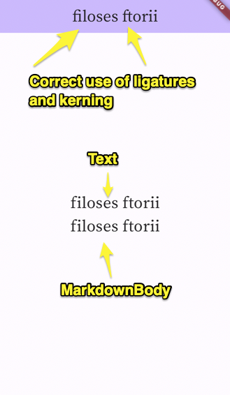

# Flutter bug report — OpenType features not being used in widgets

This repo contains the code to reproduce a potential bug in Flutter,
wherein some OpenType features such as `liga` and `kern` are not applied
in `Text` and `MarkdownBody` widgets.

